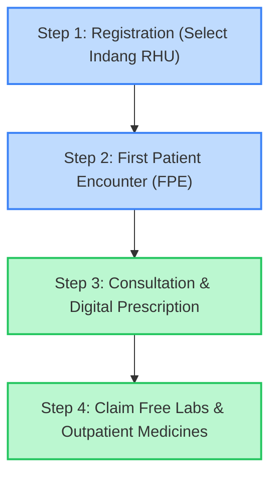

# Access Free Check-ups, Labs, and Medicines through PhilHealth YAKAP — Municipality of Indang

Get free primary care checkups, diagnostic laboratory tests, and up to **₱20,000 worth of essential outpatient medicines per year** under the upgraded PhilHealth YAKAP (Yaman ng Kalusugan Program) at the Indang Rural Health Unit (RHU) and Municipal Health Office (MHO).

---

## 1. Executive Summary & Policy Context

The upgraded **PhilHealth YAKAP (Yaman ng Kalusugan Program)** is the local implementation of the national **PhilHealth Konsulta** package, designed under the mandates of the **Philippine Universal Health Care (UHC) Act (Republic Act No. 11223)**.

The Municipality of Indang has integrated this program to ensure that **every resident has an assigned primary care team** and has immediate, secure access to essential diagnostics and maintenance medications. Under the strict **Zero Out-of-Pocket / No Balance Billing policy**, registered citizens pay absolutely nothing for consultations, laboratory workups, and covered prescription drugs at the Indang Rural Health Unit (RHU).

---

## 2. Comprehensive Quick-Reference Fact Sheet

Use this reference panel to quickly understand the timelines, requirements, and locations for availing of your YAKAP benefits.

| Information Parameter        | Official Service Details                                                                                                                                                                                                               |
| :--------------------------- | :------------------------------------------------------------------------------------------------------------------------------------------------------------------------------------------------------------------------------------- |
| **Primary Service Location** | **Indang Rural Health Unit (RHU) / Municipal Health Office**: Municipal Hall Compound, Poblacion 1, Indang, Cavite (Near the Municipal Plaza)                                                                                          |
| **Barangay Health Stations** | Initial consultations, registration assistance, and maintenance checkups are also available at all barangay health stations in Indang.                                                                                                 |
| **Eligibility Group**        | All Filipino citizens (including direct members, qualified dependents, and indirect members of any age)                                                                                                                                |
| **Operating Schedule**       | Monday to Friday, **8:00 AM – 5:00 PM** (except official holidays)                                                                                                                                                                     |
| **Out-of-Pocket Cost**       | **₱0.00 / 100% FREE** (All fees are fully covered by PhilHealth capitation and municipal subsidies)                                                                                                                                    |
| **Mandatory Documents**      | 1. PhilHealth Identification Number (PIN) or ID card 2. One (1) valid photo ID (e.g. Barangay ID, Driver's License, Senior Citizen ID) 3. PhilHealth Member Data Record (MDR) showing declared dependents (for dependent claims) |
| **Processing Speed**         | **Online Registration**: 5–10 minutes via the eGovPH App or PhilHealth Portal **First Patient Encounter (FPE)**: 30–60 minutes at the RHU                                                                                           |

---

## 3. Deep-Dive: The 13 Outpatient Diagnostic Laboratory Tests

If your assigned YAKAP primary physician recommends a laboratory evaluation during your consultation, you can undergo the following **13 diagnostic procedures completely free of charge** at the Indang RHU Laboratory.

Review the clinical details, lay descriptions, and crucial preparatory guidelines below:

### 1. Complete Blood Count (CBC) with Platelet Count

- **Layman Purpose (EN/FIL)**: Screening for infections, anemia, and dengue. / _Pagsusuri ng dugo para sa impeksyon, anemia, o dengue._
- **Clinical Description**: Analyzes the concentrations of red blood cells, white blood cells, hemoglobin, hematocrit, and platelets.
- **Preparatory Instructions**: No fasting is required. Inform the medical staff if you are taking blood thinners or antibiotics.

### 2. Urinalysis

- **Layman Purpose (EN/FIL)**: Checking for UTIs, kidney infections, or diabetes. / _Pagsuri sa ihi para malaman kung may UTI o sakit sa bato._
- **Clinical Description**: Evaluates physical, chemical, and microscopic properties of urine to detect kidney dysfunction, infection, or metabolic issues.
- **Preparatory Instructions**: Clean-catch, midstream urine sample is required. Ensure you collect the sample in the sterile container provided by the laboratory staff.

### 3. Fecalysis

- **Layman Purpose (EN/FIL)**: Checking for stomach bugs, parasites, or amoebas. / _Pagsusuri ng dumi para sa bulate o impeksyon sa tiyan._
- **Clinical Description**: Microscopic investigation of stool samples to identify intestinal parasites (helminth ova), amoeba cysts, or bacterial infections.
- **Preparatory Instructions**: Stool sample must be collected in a clean container and submitted to the laboratory within two (2) hours of collection. Avoid mixing the sample with urine or toilet water.

### 4. Fasting Blood Sugar (FBS)

- **Layman Purpose (EN/FIL)**: Sugar test to check for diabetes. / _Pagsuri ng sugar sa dugo para sa screening ng diabetes._
- **Clinical Description**: Measures blood glucose concentration after a controlled period of fasting to diagnose diabetes mellitus and pre-diabetes.
- **Preparatory Instructions**: **STRICT FASTING IS REQUIRED**. Do not eat or drink anything (except plain water) for **eight (8) to ten (10) hours** before the blood draw.

### 5. Oral Glucose Tolerance Test (OGTT)

- **Layman Purpose (EN/FIL)**: Multi-stage sugar test, essential during pregnancy. / _Advanced na pagsubok sa sugar, lalo na para sa mga buntis._
- **Clinical Description**: Involves drawing blood fasting, administering a standardized sweet glucose drink, and drawing blood again at hourly intervals to evaluate how the body processes carbohydrates.
- **Preparatory Instructions**: Fast for **eight (8) hours** before the test. Plan to remain at the laboratory/clinic for **two (2) to three (3) hours** as multiple blood samples must be drawn sequentially.

### 6. HbA1c (Glycated Hemoglobin)

- **Layman Purpose (EN/FIL)**: 3-month sugar average for diabetes control. / _Average na sugar level sa loob ng nakalipas na 3 buwan._
- **Clinical Description**: Measures the percentage of glycated hemoglobin in the blood, indicating average blood glucose control over the preceding three (3) months.
- **Preparatory Instructions**: No fasting is required. This test can be conducted at any time of the day.

### 7. Lipid Profile

- **Layman Purpose (EN/FIL)**: Cholesterol panel to check heart and stroke risk. / _Sukat ng cholesterol at triglycerides (risko sa sakit sa puso)._
- **Clinical Description**: Evaluates Total Cholesterol, High-Density Lipoprotein (HDL / "good" cholesterol), Low-Density Lipoprotein (LDL / "bad" cholesterol), and Triglycerides to map cardiovascular risks.
- **Preparatory Instructions**: **FASTING IS REQUIRED**. Do not consume any food, milk, or sweetened beverages for **ten (10) to twelve (12) hours** before the blood test. Only plain water is permitted.

### 8. Creatinine

- **Layman Purpose (EN/FIL)**: Test to monitor kidney function and health. / _Pagsusuri sa kalusugan at function ng mga bato (kidney)._
- **Clinical Description**: Measures the concentration of creatinine in the blood to estimate the Glomerular Filtration Rate (eGFR), screening for chronic kidney disease.
- **Preparatory Instructions**: Inform your physician if you consume high amounts of protein supplements or red meat, as this can temporarily skew results. Fasting is not mandatory but recommended.

### 9. Electrocardiogram (ECG)

- **Layman Purpose (EN/FIL)**: Tracing of heart rhythm and electrical health. / _Pagsuri sa ritmo at tibok ng iyong puso._
- **Clinical Description**: Records the electrical signals generated by heart muscle activity to diagnose arrhythmias, ischemic damage, or structural abnormalities.
- **Preparatory Instructions**: Avoid applying oily lotions or body powders to the chest area on the day of the test. Wear loose clothing for easy placement of electrode pads.

### 10. Chest X-ray

- **Layman Purpose (EN/FIL)**: X-ray for pneumonia, bronchitis, or tuberculosis. / _Larawan ng baga para sa pneumonia o tuberculosis (TB)._
- **Clinical Description**: Utilizes safe, low-dose radiation imaging to visualize the lungs, heart, ribs, and diaphragm for clinical monitoring.
- **Preparatory Instructions**: Wear comfortable clothing. You will be asked to remove all metallic items, jewelry, and undergarments with metal underwires before entering the X-ray cabinet.

### 11. Sputum Microscopy / GeneXpert

- **Layman Purpose (EN/FIL)**: Phlegm analysis to confirm tuberculosis. / _Pagsuri ng plema para sa kumpirmasyon ng TB._
- **Clinical Description**: Highly sensitive biological screening that analyzes coughed sputum to detect active Mycobacterium tuberculosis bacteria and determine antibiotic resistance.
- **Preparatory Instructions**: Collect the deep-cough phlegm sample (not saliva) first thing in the morning, immediately after rinsing your mouth with plain water.

### 12. Pap Smear

- **Layman Purpose (EN/FIL)**: Preventive screening for cervical cancer. / _Screening ng cervix para sa pag-iwas sa cervical cancer._
- **Clinical Description**: Gentle collection of cervical mucosal cells to look for precancerous and cancerous cell changes caused by Human Papillomavirus (HPV).
- **Preparatory Instructions**: Do not engage in sexual intercourse, use vaginal medicines, douches, or spermicidal creams for **forty-eight (48) hours** before the procedure. Schedule the test when you do not have your menstrual period.

### 13. Fecal Occult Blood Test (FOBT)

- **Layman Purpose (EN/FIL)**: Stool check for hidden blood to screen for colon cancer. / _Pagsuri kung may nakatagong dugo sa dumi (screen ng colon cancer)._
- **Clinical Description**: Chemical evaluation of stool samples to identify microscopic, non-visible blood leaks, signaling colon polyps, ulcers, or early colorectal cancer.
- **Preparatory Instructions**: Refrain from eating red meat, taking high doses of Vitamin C, or consuming iron supplements for **three (3) days** prior to sample collection to prevent false-positive chemical readings.

---

## 4. Covered Medicine Finder (GAMOT Package Catalog)

Under the **YAKAP Outpatient GAMOT Package**, every registered citizen is allotted up to **₱20,000 worth of free prescription medicines per year**.

The medicines are classified into clinical categories to help manage acute diseases and chronic maintenance conditions:

### 1. Cardiovascular & Hypertension (High Blood Pressure)

For managing chronic high blood pressure, preventing heart failure, and reducing stroke risks:

- **Amlodipine Besilate** (5mg, 10mg Tablets) — Relaxes blood vessels to lower blood pressure and prevent chest pain (angina).
- **Losartan Potassium** (50mg, 100mg Tablets) — Blocks angiotensin receptors to keep blood vessels open and protect kidney function.
- **Metoprolol Tartrate** (50mg, 100mg Tablets) — Slows down heart rate and reduces workload on heart muscles.
- **Enalapril Maleate** (5mg Tablet) — High-efficacy ACE inhibitor protecting the heart and managing moderate hypertension.
- **Hydrochlorothiazide** (25mg Tablet) — Safe diuretic (water pill) helping the body flush out excess sodium and fluid.

### 2. Diabetes & Endocrine Care

For controlling blood glucose levels and managing thyroid dysfunctions:

- **Metformin Hydrochloride** (500mg, 850mg, 1000mg Tablets) — Boosts insulin sensitivity and controls sugar absorption in the stomach.
- **Gliclazide** (30mg, 60mg, 80mg Tablets) — Stimulates pancreas cells to release natural insulin for type 2 diabetes management.
- **Levothyroxine Sodium** (25mcg, 50mcg, 100mcg Tablets) — Synthesizes and replaces lacking thyroid hormones in patients with hypothyroidism.

### 3. Respiratory & Asthma Management

For managing chronic bronchial asthma, emergency wheezing, and persistent coughs:

- **Salbutamol Sulfate** (2mg/5mL Syrup, 100mcg/dose Inhaler, 1mg/mL Nebule) — Fast-acting bronchodilator to open airways during sudden asthma attacks.
- **Fluticasone Propionate + Salmeterol** (50mcg/250mcg, 50mcg/500mcg Inhalers) — Long-term maintenance steroid inhaler preventing chronic swelling of the lungs.
- **Prednisone** (10mg, 20mg Tablets, 10mg/5mL Liquid) — Highly effective systemic corticosteroid reducing severe inflammation during acute asthma flareups.

### 4. Antibiotics & Anti-infectives

Prescribed for targeted bacterial infections, urinary tract infections (UTIs), and seasonal respiratory conditions:

- **Amoxicillin Trihydrate** (250mg, 500mg Capsules, 100mg/mL Drops, 250mg/5mL Syrup) — Broad-spectrum antibiotic for ear, throat, and chest infections.
- **Co-Amoxiclav / Amoxicillin + Potassium Clavulanate** (625mg Tablet, 228.5mg/5mL Syrup) — Powerful combination antibiotic targeting resistant bacterial strains.
- **Ciprofloxacin** (500mg Tablet) — High-potency antibiotic indicated for urinary tract (UTI) and complex intestinal infections.
- **Clarithromycin** (500mg Tablet, 125mg/5mL Syrup) — Macrolide antibiotic for moderate skin, chest, and soft tissue infections.
- **Nitrofurantoin** (100mg Capsule) — Targeted antibiotic specialized in treating and preventing urinary tract infections (UTIs).
- **Cotrimoxazole / Sulfamethoxazole + Trimethoprim** (800mg/160mg Tablet, 400mg/80mg Syrup) — Combination antibiotic for chest, ear, and bowel infections.
- **Doxycycline Hyclate** (100mg Capsule) — Indicated for various bacterial infections, including acute prevention of Leptospirosis.

### 5. Analgesics, Antipyretics & Anti-Inflammatory (Fever & Pain Relief)

For treating high fever, toothaches, joint inflammations, and muscle strains:

- **Paracetamol** (500mg Tablet, 250mg/5mL Syrup, 100mg/mL drops) — Fast, safe antipyretic to lower fever and relieve general aches.
- **Ibuprofen** (200mg, 400mg Tablets, 100mg/5mL Syrup) — Anti-inflammatory drug (NSAID) that targets severe pain and swelling.
- **Mefenamic Acid** (250mg, 500mg Capsules) — Fast-acting analgesic targeted at resolving acute toothaches, arthritis pain, and dysmenorrhea.

### 6. Antihistamines (Allergy Relief)

For resolving allergic rhinitis, skin rashes, and hives:

- **Cetirizine Dihydrochloride** (10mg Tablet, 5mg/5mL Syrup) — Non-drowsy, 24-hour antihistamine resolving allergy symptoms.
- **Chlorpheniramine Maleate** (4mg Tablet) — Highly effective classic antihistamine providing fast relief from hives and severe allergy itching.

### 7. Cardiovascular Support & Anticoagulants

- **Aspirin / Acetylsalicylic Acid** (80mg, 100mg Enteric-Coated Tablets) — Low-dose blood thinner to prevent cardiovascular blood clot formations.
- **Clopidogrel Bisulfate** (75mg Tablet) — Strong antiplatelet keeping blood flowing smoothly after structural stroke history.

### 8. Gastrointestinal & Rehydration Support

For treating stomach hyperacidity, peptic ulcers, abdominal cramps, and diarrhea:

- **Omeprazole** (20mg, 40mg Capsules) — Proton Pump Inhibitor (PPI) that decreases stomach acid production to heal ulcers and treat acid reflux.
- **Famotidine** (20mg Tablet) — Fast H2-blocker resolving acute heartburn and indigestion.
- **Dicycloverine Hydrochloride** (10mg Tablet, 10mg/5mL Syrup) — Antispasmodic designed to relax intestinal muscles and resolve abdominal cramps.
- **Domperidone** (10mg Tablet) — Relief for acute nausea, vomiting, and abdominal bloating.
- **Oral Rehydration Salts (ORS)** (Powder Sachet) — Electrolyte-rich formulation to quickly replace fluids lost during vomiting and diarrhea.

### 9. Nutritional, Hematinycs & Metabolic Supplements

- **Multivitamins (Adult / Pediatric)** (Tablet, Syrup, Drops) — Daily supplemental support to boost immune defense against seasonal viral illnesses.
- **Ferrous Sulfate + Folic Acid** (Iron Supplement Tablet) — High-absorption iron supplement to treat and prevent anemia during pregnancy.
- **Calcium Carbonate** (500mg Tablet) — Vital supplement ensuring strong bone density and tooth integrity.
- **Zinc Sulfate** (55mg Tablet, 20mg/5mL Syrup) — Pediatric mineral supplement critical for boosting diarrhea recovery times.

---

## 5. Detailed Step-by-Step Patient Enrollment and Journey

Activating and using your PhilHealth YAKAP benefits in Indang is simple. Follow this comprehensive, step-by-step walk-through:

### Step 1: Register and Select Indang RHU

You must explicitly assign the Indang Rural Health Unit (RHU) as your primary care provider.

- **Option A: Online Registration via the eGovPH App (Recommended)**:
  1.  Download the official **eGovPH** app from the Google Play Store or Apple App Store.
  2.  Complete the registration process and undergo facial verification to secure your account.
  3.  Tap on **Government Services** and select the **PhilHealth Portal**.
  4.  Navigate to the **YAKAP / Konsulta** section.
  5.  Under primary care clinic selection, type and search **Indang Rural Health Unit (RHU)** or **Indang Municipal Health Office**.
  6.  Confirm the selection. Take a screenshot of your registration slip as digital proof.
- **Option B: Online Registration via PhilHealth Portal**:
  1.  Access the official portal at [www.philhealth.gov.ph/yakap/](https://www.philhealth.gov.ph/yakap/).
  2.  Log in to your Member Portal account. If you do not have an account, register using your PhilHealth Identification Number (PIN).
  3.  Find the **Konsulta Registration** tab on your user dashboard.
  4.  Search for and assign **Indang Rural Health Unit** as your primary health center.
- **Option C: In-Person Municipal Registration**:
  1.  Visit the Municipal Health Office registration windows at the Indang Municipal Hall Compound.
  2.  Bring your PhilHealth ID, PIN, and any valid government-issued photo ID.
  3.  Fill out the official registration form and hand it to the health clerk, who will enroll you immediately in the digital YAKAP database.

### Step 2: Undergo the First Patient Encounter (FPE)

To legally activate your laboratory and pharmacy allowance, you must undergo a baseline screening.

1.  **Visit the RHU**: Bring your registration receipt and go to the Indang Rural Health Unit (RHU).
2.  **Profiling**: The RHU medical staff will measure your baseline biometrics (height, weight, blood pressure) and document your complete medical history.
3.  **Digital EHR Sync**: This information is officially synced into the **PhilHealth Electronic Health Record (EHR)**. Once saved, your laboratory and medicine allowances are fully unlocked!

### Step 3: Consult Your Primary Care Doctor

1.  Whenever you feel unwell, require clinical monitoring, or need maintenance drug refills, consult your doctor at the Indang RHU.
2.  The doctor will log the consultation details in your digital medical chart.
3.  If you require checkups or medications, your doctor will issue an official electronic YAKAP prescription automatically synced with the laboratory and pharmacy.

### Step 4: Claim Free Laboratories and Medicines

1.  **For Free Labs**: Go directly to the RHU Laboratory window and present your doctor's lab order. The staff will extract blood, collect samples, or perform imaging without requiring any payment.
2.  **For Free Medicines**: Go to the RHU Pharmacy window and present your prescription. The pharmacist will dispense the covered generic medications instantly at zero cost. The medication cost is automatically deducted from your annual **₱20,000 GAMOT package limit**.

---

## 6. Universal Eligibility & Qualified Dependents

The YAKAP program operates under a universal-access mandate:

- **Active Members Covered**:
  - **Government & Private Employees** (Formal Economy)
  - **Self-Earning Individuals** (Voluntary Members, Professionals, Farmers)
  - **Kasambahay / Household Helps**
  - **Indigents & 4Ps Beneficiaries** (Fully sponsored by national government)
  - **Persons with Disabilities (PWDs)** & **Senior Citizens**
- **Qualified Dependents Covered**:
  Registered dependents receive their own separate consultations, checkups, and outpatient laboratory/medicine packages:
  - Legitimate spouse who is not an active PhilHealth member.
  - Unmarried and unemployed children below twenty-one (21) years old.
  - Children twenty-one (21) years old and above with physical or mental disabilities.
  - Parents who are sixty (60) years old and above and are not active members.

> [!IMPORTANT]
> To ensure your dependents can register under the Indang YAKAP program, check your updated **Member Data Record (MDR)**. If any dependents are missing, submit a PhilHealth Member Registration Form (PMRF) immediately at the Municipal Health Office.

---

## 7. Frequently Asked Questions (FAQ)

**Q: Is there really no payment required?**
A: **Yes, it is 100% free**. The PhilHealth YAKAP program operates under a zero out-of-pocket / zero balance billing policy for all covered services at government primary clinics. You do not need to pay for consultations, laboratory tests, or covered prescription drugs.

**Q: Can I register my entire family under one PhilHealth account?**
A: Yes! As long as they are declared as dependents on your PhilHealth Member Data Record (MDR). Each dependent can register under YAKAP and will get access to their own consultations, checkups, and free diagnostics.

**Q: What if the medicine prescribed by my doctor is not on the YAKAP list?**
A: Only the 75+ generic formulations approved under the PhilHealth GAMOT package are fully covered. If you require a non-covered medication, you will need to purchase it at your own expense.

**Q: Can I change my designated YAKAP clinic later?**
A: Yes, you can change your designated clinic once a year or if you relocate. You can update this online via the PhilHealth portal/eGovPH app or by visiting the Municipal Health Office.

**Q: Does the ₱20,000 medicine allowance reset every calendar year?**
A: **Yes, it resets every January 1st**. The ₱20,000 outpatient medicine allocation operates on a calendar year basis. Any unused balance at the end of the year does not roll over.

**Q: Are private diagnostic centers in Indang covered by this program?**
A: Only diagnostics performed at the Indang RHU Laboratory or private facilities explicitly accredited under the PhilHealth Konsulta network are covered. Always check with the RHU staff before proceeding to private diagnostic facilities.

---

## 8. Official Institutional References & Legal Mandates

The Indang YAKAP Program operates in strict compliance with national public health frameworks:

- **Republic Act No. 11223 (Universal Health Care Act)**: Mandates health system integrations ensuring primary care access for all Filipinos.
- **PhilHealth Circular No. 2023-0013**: Defines the implementing rules for the PhilHealth Konsulta / YAKAP capitation, outpatient benefits, and pharmacy packages.
- **Indang Municipal Ordinance Series**: Establishes local administrative protocols supporting primary care clinic allocations and health office integrations.

---

## 9. Local Contact Directory

For inquiries, registration assistance, or feedback regarding PhilHealth YAKAP in Indang, contact the following offices:

- **Primary Health Center**: Indang Rural Health Unit (RHU) / Municipal Health Office (MHO)
- **Physical Address**: Indang Municipal Hall Compound, Poblacion 1, Indang, Cavite (Geographical Landmark: Near the Municipal Plaza and Church)
- **Landline Telephone**: (046) 840-1705
- **Local Mobile Hotlines**: 0977-766-6707 / 0928-123-4567
- **Official LGU Email Address**: health@indang.gov.ph
- **PhilHealth Cavite Local Health Office (Trece Martires)**: (046) 419-0740 / cavite.lho@philhealth.gov.ph
- **PhilHealth 24/7 Action Center**: (02) 8662-2588 / Callback SMS: 0998-857-2957

---

## 10. Official Notice & LGU Medical Disclaimer

> [!WARNING]
> **OPISYAL NA PAUNAWA / MEDICAL DISCLAIMER**
>
> - **Para sa Pabatid-Publiko**: Ang lahat ng medikal na impormasyong nakasaad sa gabay na ito, kabilang ang listahan ng 13 diagnostic tests at 77 generic na gamot, ay inihanda lamang para sa pangkalahatang kaalaman ng mga residente ng Indang, Cavite. Ito ay hindi kapalit ng propesyonal na payo, diagnosis, o paggamot ng doktor.
> - **Self-Medication**: Mahigpit na ipinagbabawal ang self-medication. Huwag uminom ng anumang gamot nang walang opisyal na reseta mula sa inyong doktor.
> - **Klinikal na Awtoridad**: Ang Indang Rural Health Unit (RHU) at Municipal Health Office (MHO) ang may ganap at klinikal na awtoridad na mag-diagnose, mag-reseta, at magbigay ng gamot alinsunod sa mga alituntunin ng PhilHealth at Universal Health Care (UHC) Circular 2023-0013.
>
> ---
>
> **OFFICIAL NOTICE & MEDICAL DISCLAIMER**
>
> - **For General Public Information**: All medical content published in this guide, including the reference registry of 13 diagnostic procedures and 77 generic medications, is curated solely for general public education and reference for the residents of Indang, Cavite. It is not intended to replace professional healthcare consultations, diagnosis, or treatment.
> - **Self-Medication**: Self-medication is strictly prohibited. Do not take any medication without an official prescription issued by a licensed physician.
> - **Clinical Authority**: The Indang Rural Health Unit (RHU) and Municipal Health Office (MHO) hold the sole clinical authority to diagnose, prescribe, and dispense medications under the strict guidelines of PhilHealth and the Universal Health Care (UHC) Circular 2023-0013.
